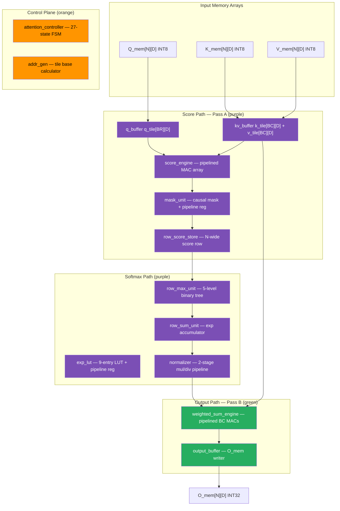
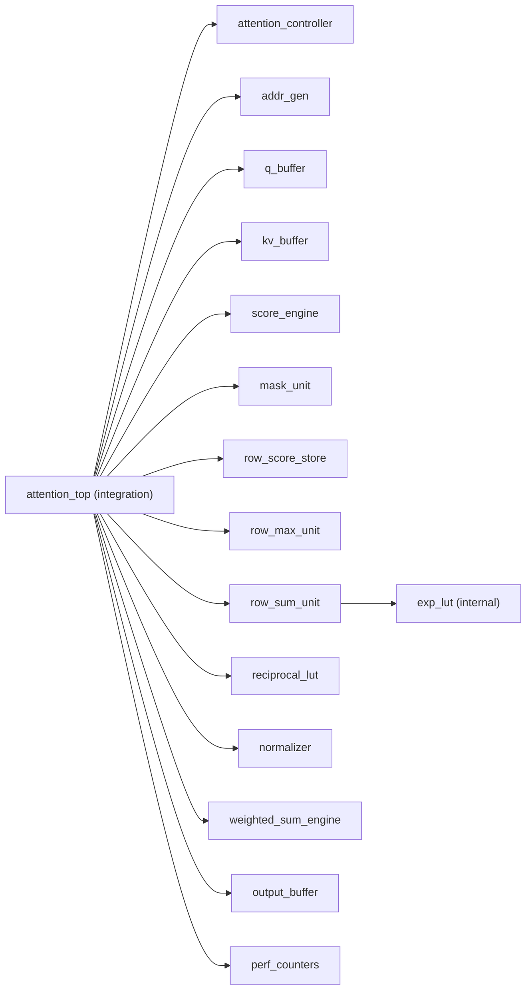
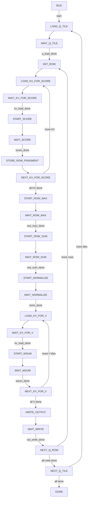

# IO-Aware Tiled Causal Self-Attention Accelerator — Design Specification

**Version:** 1.0 | **Top Module:** `attention_top` | **Status:** Released

---

## Table of Contents
1. [Introduction](#1-introduction)
2. [Feature Summary](#2-feature-summary)
3. [Functional Description](#3-functional-description)
4. [Interface Description](#4-interface-description)
5. [Parameterization Options](#5-parameterization-options)
6. [Performance Counters & Observability](#6-performance-counters--observability)
7. [Design Guidelines](#7-design-guidelines)
8. [Timing Diagrams](#8-timing-diagrams)

---

## 1. Introduction

The **IO-Aware Tiled Causal Self-Attention Accelerator** is a fixed-function digital hardware core that computes scaled dot-product causal self-attention over an input sequence. It targets FPGA or ASIC implementation and is designed for high-frequency operation through a fully pipelined datapath.

### 1.1 Mathematical Operation

For each query position `q` (causal — attends only to positions ≤ q):

```
score[q][k]  = (Q[q] · K[k]) >>> SCALE_SHIFT    for k ≤ q
             = NEG_INF                            for k > q  (causal mask)

weight[q][k] = exp(score[q][k] − max_score[q]) / Σ_k exp(score[q][k] − max_score[q])

O[q]         = Σ_k weight[q][k] × V[k]
```

### 1.2 Key Design Decisions

| Decision | Choice | Rationale |
|---|---|---|
| Tiling strategy | IO-aware blocked tiling (BR×BC tiles) | Minimises memory bandwidth; reuses loaded tiles across inner loop |
| Causal masking | Sequential pipeline register post-score | Zero-latency overhead; absorbed by FSM state transition gap |
| Softmax numerics | Row-max subtraction before exp | Prevents fixed-point overflow; mathematically equivalent result |
| Normalisation | Direct division `(exp × 0xFFFF) / row_sum` | Avoids catastrophic precision loss in single-token degenerate rows |
| Pipeline stages | 1 register per compute-module critical path | Each long combinational path isolated to its own clock period |
| Data format | INT8 inputs, INT32 accumulators, Q0.16 probabilities | Hardware-efficient; sufficient dynamic range for attention scores |

---

## 2. Feature Summary

### 2.1 Requirements

| REQ_ID | Title | Type | Acceptance Criteria |
|---|---|---|---|
| REQ_001 | Causal self-attention computation | Functional | O_mem matches software reference model for all N×D output elements |
| REQ_002 | Tiled execution (BR=4, BC=4) | Architectural | Q processed in BR-row tiles; K/V processed in BC-column tiles |
| REQ_003 | Sequence length N=32, head dim D=16 | Parametric | Correct output across full 32×16 output matrix |
| REQ_004 | INT8 Q/K/V inputs, INT32 accumulation | Data Format | DATA_W=8 signed inputs; SCORE_W=OUT_W=32 accumulators |
| REQ_005 | Causal masking | Functional | Positions where global_k > global_q produce zero attention weight |
| REQ_006 | Numerically stable softmax | Functional | Row-max subtraction; no overflow in exp LUT or accumulator |
| REQ_007 | Fully pipelined datapath | Performance | All major combinational paths broken by registered pipeline stages |
| REQ_008 | Single clock domain | Architectural | All FFs clocked on `clk`; synchronous active-low `rst_n` |
| REQ_009 | Performance counter visibility | Observability | Cycle-accurate counters for score, softmax, wsum, load, stall phases |
| REQ_010 | Deterministic fixed latency | Functional | No data-dependent stalls; FSM wait-states only on done pulses |

### 2.2 Ambiguity Log

| Q_ID | Question | Impact | Assumed Default |
|---|---|---|---|
| Q_001 | Target clock frequency? | Synthesis constraint | Not specified; design maximises achievable fmax |
| Q_002 | FPGA target device? | Resource utilisation | Xilinx 7-series (Vivado project present in workspace) |
| Q_003 | AXI register map specification? | SW driver | Deferred to `attention_axi_wrapper` supplementary document |
| Q_004 | Runtime-variable N, D? | Controller flexibility | Fixed at elaboration via package parameters only |

---

## 3. Functional Description

### 3.1 Hardware Architecture Overview

The accelerator consists of three functional layers: the **control plane** (FSM + address generation), the **score path** (Pass A), and the **softmax+output path** (Pass B).



**Figure 3.1** — Top-level dataflow from input arrays through two-pass tiled computation to output memory.

### 3.2 RTL Module Hierarchy



**Figure 3.2** — RTL instantiation hierarchy. `exp_lut` is internal to `row_sum_unit`; all others are direct children of `attention_top`.

### 3.3 Two-Pass Algorithm

**Pass A — Score Collection:**
1. Load Q tile `q_tile[BR][D]` from Q_mem into q_buffer
2. For each KV tile (kv_tile_idx = 0 .. NUM_KV_TILES-1):
   - Load `k_tile[BC][D]` + `v_tile[BC][D]` from K/V_mem into kv_buffer
   - `score_engine`: `score_tile[r][c] = (q_tile[r] · k_tile[c]) >>> 2`
   - `mask_unit`: set `score_tile[r][c] = NEG_INF` if `global_k > global_q`
   - `row_score_store`: append BC-wide fragment to row score buffer

**Softmax (after all KV tiles in Pass A):**
3. `row_max_unit`: 5-level binary tree → `row_max` in 5 cycles
4. `row_sum_unit` + `exp_lut`: compute `exp_row[i]` and `row_sum` in N+2 cycles
5. `normalizer`: compute `prob_row[i] = (exp_row[i] × 0xFFFF) / row_sum` in N+2 cycles

**Pass B — Output Accumulation:**
6. For each KV tile (kv_tile_idx = 0 .. NUM_KV_TILES-1):
   - Reload KV tile (v_tile used only)
   - `weighted_sum_engine`: `acc[d] += Σ_c prob_slice[c] × v_tile[c][d]` in D+2 cycles
   - First tile only: `clear_acc` zeroes the accumulator
7. `output_buffer`: write `acc[D]` → `O_mem[global_q_idx][:]`

Repeat for all BR rows per Q tile, all NUM_Q_TILES Q tiles.

### 3.4 Controller FSM

The `attention_controller` implements a 27-state FSM. All transitions are event-driven on one-cycle `done` pulses from compute modules.



**Figure 3.3** — Controller FSM. Wait-states block until the submodule `done` pulse fires.

### 3.5 Pipeline Architecture

All compute modules with long combinational paths have pipeline registers to maximise fmax:

| Module | Original Critical Path | Pipeline Strategy | Net Overhead |
|---|---|---|---|
| `score_engine` | 32×32 multiplier → accumulator | Register `mac_product_reg`; `comp_first` + `DRAIN` state | +1 cycle/tile |
| `exp_lut` | 9-level priority comparator | Register `exp_value` output | Absorbed by `row_sum_unit` `S_DRAIN` |
| `mask_unit` | BR×BC comparators + mux | Register `score_tile_out` | 0 net (absorbed by WAIT_SCORE→STORE_ROW_FRAGMENT gap) |
| `normalizer` | Multiply × 0xFFFF + divide | Stage 1: register multiply result; Stage 2: divide with registered inputs | +1 cycle/row |
| `weighted_sum_engine` | BC MACs + 2-level adder tree → acc | Register `adder_sum_reg`; `accum_first` + `DRAIN` state | +1 cycle/tile |
| `reciprocal_lut` | Combinational `65536/row_sum` divider | Register output | 0 net (output not on active data timing path) |

---