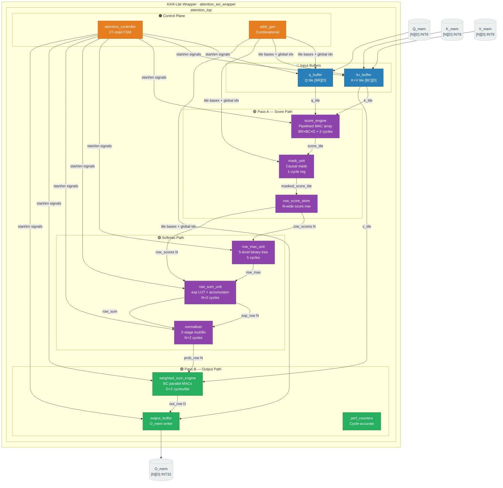

<div align="center">

# ⚡ FlashAttention Inspired Tiled Causal Self-Attention Accelerator

<p align="center">
  
  
  
  
  
</p>

<p align="center">
  A fixed-function FPGA/ASIC core that computes <strong>scaled dot-product causal self-attention</strong> over an input sequence using IO-aware blocked tiling, a fully pipelined datapath, and numerically stable fixed-point softmax — inspired by the memory efficiency principles of FlashAttention.
</p>

</div>

---

## 📋 Table of Contents

- [Mathematical Background](#-mathematical-background)
- [Key Design Decisions](#-key-design-decisions)
- [Architecture Overview](#-architecture-overview)
- [Module Hierarchy](#-module-hierarchy)
- [Tiled Algorithm — Two-Pass Flow](#-tiled-algorithm--two-pass-flow)
- [Controller FSM](#-controller-fsm--27-states)
- [Module Reference](#-module-reference)
- [Parameters & Data Formats](#-parameters--data-formats)
- [AXI-Lite Register Map](#-axi-lite-register-map)
- [Performance Counters](#-performance-counters)
- [Pipeline Optimisations](#-pipeline-optimisations)
- [Latency Analysis](#-latency-analysis)
- [File Listing & Compile Order](#-file-listing--compile-order)
- [Simulation & Build](#-simulation--build)
- [Signal Ownership Reference](#-signal-ownership-reference)
- [Known Limitations](#-known-limitations)

---

## 📐 Mathematical Background

For each query position `q` in a sequence of length `N`, causal self-attention computes:

```
score[q][k]  =  ( Q[q] · K[k] ) >>> SCALE_SHIFT     for k ≤ q
             =  NEG_INF                               for k > q   (causal mask)

weight[q][k] =  exp( score[q][k] − max_k(score[q]) )
                ─────────────────────────────────────
                Σ_k  exp( score[q][k] − max_k(score[q]) )

O[q]         =  Σ_k  weight[q][k] × V[k]
```

The **row-max subtraction** before exponentiation is the FlashAttention-style numerically stable trick — mathematically equivalent to standard softmax while preventing fixed-point overflow.

---

## 🎯 Key Design Decisions

| Decision | Choice | Rationale |
|:---|:---|:---|
| **Tiling strategy** | IO-aware `BR × BC` blocking | Minimises memory bandwidth; reuses loaded tiles across inner loop |
| **Causal masking** | Sequential pipeline register post-score | Zero-latency overhead; absorbed by FSM state gap |
| **Softmax numerics** | Row-max subtraction before exp | Prevents fixed-point overflow; mathematically equivalent |
| **Normalisation** | `(exp × 0xFFFF) / row_sum` direct divide | Avoids precision collapse on single-attended-token rows |
| **Pipeline stages** | 1 register per critical path | Each long combinational path isolated to its own clock period |
| **Data format** | INT8 inputs · INT32 accumulators · Q0.16 probs | Hardware-efficient; sufficient dynamic range |
| **Scale shift** | `>>> 2` (÷4) | Maps INT8 dot products into exp LUT input range |

---

## 🏗️ Architecture Overview



---

## 🗂️ Module Hierarchy

```
attention_axi_wrapper              ← AXI4-Lite FPGA integration wrapper
└── attention_top                  ← Top-level integration + prob_slice glue
    ├── attention_controller       ← 27-state control FSM                   [Parin]
    ├── addr_gen                   ← Combinational index/address calculator  [Parin]
    ├── q_buffer                   ← Query tile register file [BR][D]        [Parin]
    ├── kv_buffer                  ← Key+Value tile register file [BC][D]    [Parin]
    ├── score_engine               ← BR×BC pipelined MAC dot-product array   [Amogha]
    ├── mask_unit                  ← Causal mask with 1-cycle pipeline reg   [Amogha]
    ├── row_score_store            ← N-wide score row fragment collector      [Amogha]
    ├── row_max_unit               ← 5-level pipelined binary max tree       [Jainil]
    ├── row_sum_unit               ← exp LUT scan + row_sum accumulator      [Jainil]
    │   └── exp_lut                    ← 9-entry LUT, 1-cycle pipeline reg
    ├── reciprocal_lut             ← 65536/row_sum, pipelined                [Jainil]
    ├── normalizer                 ← 2-stage mul/div probability row gen     [Jainil]
    ├── weighted_sum_engine        ← BC=4 parallel MACs + D accumulator      [Jainil]
    ├── output_buffer              ← O_mem row writer                        [Parin]
    └── perf_counters              ← Cycle-accurate phase observability      [Parin]
```

> **Team Ownership**
>
> | Owner | Modules |
> |:---|:---|
> | **Parin** | `attention_pkg`, `addr_gen`, `q_buffer`, `kv_buffer`, `output_buffer`, `perf_counters`, `attention_controller`, `attention_top` |
> | **Amogha** | `score_engine`, `mask_unit`, `row_score_store` |
> | **Jainil** | `row_max_unit`, `exp_lut`, `row_sum_unit`, `reciprocal_lut`, `normalizer`, `weighted_sum_engine` |

---

## 🔄 Tiled Algorithm — Two-Pass Flow

The accelerator processes Q in `BR`-row tiles and K/V in `BC`-column tiles. At default parameters (`N=32, D=16, BR=4, BC=4`) there are **8 Q-tiles** and **8 KV-tiles**.

```
┌─────────────────────────────────────────────────────────────────────────────┐
│  for q_tile_idx = 0 .. 7  (8 Q tiles)                                      │
│    ┌─ load q_tile [4][16] from Q_mem                          [64 cycles]   │
│    │                                                                        │
│    │  for q_local_row = 0 .. 3  (4 rows per Q tile)                        │
│    │    │                                                                   │
│    │    ├── PASS A : Score Collection ──────────────────────────────────    │
│    │    │   clear row_score_store                                           │
│    │    │   for kv_tile = 0 .. 7:                                           │
│    │    │     load k_tile + v_tile [4][16]               [64 cycles]        │
│    │    │     score_tile = (q_row · k_tile^T) >>> 2      [258 cycles]       │
│    │    │     mask_unit: score[r][c] = NEG_INF if k > q  [1 cycle, piped]   │
│    │    │     row_score_store ← append BC scores          [1 cycle]         │
│    │    │                                                                   │
│    │    ├── SOFTMAX ──────────────────────────────────────────────────────  │
│    │    │   row_max  = max(row_scores[32])                [5 cycles]        │
│    │    │   exp_row  = exp(row_scores − row_max)          [34 cycles]       │
│    │    │   row_sum  = Σ exp_row[i]         (computed simultaneously)       │
│    │    │   prob_row = (exp_row × 0xFFFF) / row_sum       [34 cycles]       │
│    │    │                                                                   │
│    │    └── PASS B : Output Accumulation ─────────────────────────────────  │
│    │        for kv_tile = 0 .. 7:                                           │
│    │          reload v_tile [4][16]                       [64 cycles]       │
│    │          prob_slice = prob_row[kv_tile_base : +4]    (glue in top)     │
│    │          acc[d] += Σ_c prob_slice[c] × v_tile[c][d] [18 cycles/tile]  │
│    │          (clear acc only on the first tile of each row)                │
│    │        write acc → O_mem[global_q_idx][:]            [16 cycles]       │
└────┴───────────────────────────────────────────────────────────────────────┘
```

### Data Flow

```
Q_mem ──► q_buffer ──────────────────────────────────► score_engine ──┐
                                                                       │ score_tile
K_mem ──► kv_buffer ─── k_tile (Pass A) ────────────► score_engine   │
V_mem ──► kv_buffer ──┐                                               ▼
                       │                                         mask_unit
                       │                                               │ masked_score_tile
                       │                                    row_score_store [N]
                       │                                               │ row_scores[N]
                       │                                ┌──────────────┤
                       │                          row_max_unit   row_sum_unit
                       │                                │ row_max       │
                       │                                └──────────────►│
                       │                                           exp_row[N]
                       │                                           row_sum
                       │                                               │
                       │                                         normalizer
                       │                                               │ prob_row[N]
                       │  v_tile (Pass B)              prob_slice[4]   │
                       └───────────────────────────────────────────────►│
                                                                        ▼
                                                        weighted_sum_engine
                                                                        │ out_row[D]
                                                              output_buffer
                                                                        │
                                                              O_mem [N][D]
```

---

## 🤖 Controller FSM — 27 States

```mermaid
flowchart TD
    IDLE([IDLE]) -->|start| LQT

    LQT[LOAD_Q_TILE\nq_load_start] --> WQT[WAIT_Q_TILE]
    WQT -->|q_load_done| IR

    IR[INIT_ROW\nrow_store_start_row] --> LKVS

    LKVS[LOAD_KV_FOR_SCORE\nkv_load_start] --> WKVS[WAIT_KV_FOR_SCORE]
    WKVS -->|kv_load_done| SS[START_SCORE\nscore_start]
    SS --> WS[WAIT_SCORE]
    WS -->|score_done| SRF[STORE_ROW_FRAGMENT\nrow_store_en]
    SRF --> NKVS[NEXT_KV_FOR_SCORE\nkv_tile_idx++]

    NKVS -->|more KV tiles| LKVS
    NKVS -->|all KV done| SRM

    SRM[START_ROW_MAX\nrow_max_start] --> WRM[WAIT_ROW_MAX]
    WRM -->|row_max_done| SRS[START_ROW_SUM\nrow_sum_start]
    SRS --> WRS[WAIT_ROW_SUM]
    WRS -->|row_sum_done| SN[START_NORMALIZE\nnorm_start]
    SN --> WN[WAIT_NORMALIZE]

    WN -->|norm_done| LKVV

    LKVV[LOAD_KV_FOR_V\nkv_load_start] --> WKVV[WAIT_KV_FOR_V]
    WKVV -->|kv_load_done| SW[START_WSUM\nwsum_start\nclear_acc if idx==0]
    SW --> WW[WAIT_WSUM]
    WW -->|wsum_done| NKVV[NEXT_KV_FOR_V\nkv_tile_idx++]

    NKVV -->|more V tiles| LKVV
    NKVV -->|all V done| WO

    WO[WRITE_OUTPUT\nout_write_en] --> WW2[WAIT_WRITE]
    WW2 -->|out_write_done| NQR[NEXT_Q_ROW\nq_local_row_idx++]

    NQR -->|more rows in tile| IR
    NQR -->|all rows done| NQT[NEXT_Q_TILE\nq_tile_idx++]

    NQT -->|more Q tiles| LQT
    NQT -->|all done| DONE([DONE\ndone asserted])

    style IDLE fill:#2ecc71,color:#fff,stroke:#27ae60
    style DONE fill:#2ecc71,color:#fff,stroke:#27ae60
    style LQT fill:#3498db,color:#fff,stroke:#2980b9
    style WQT fill:#3498db,color:#fff,stroke:#2980b9
    style IR fill:#9b59b6,color:#fff,stroke:#8e44ad
    style LKVS fill:#9b59b6,color:#fff,stroke:#8e44ad
    style WKVS fill:#9b59b6,color:#fff,stroke:#8e44ad
    style SS fill:#9b59b6,color:#fff,stroke:#8e44ad
    style WS fill:#9b59b6,color:#fff,stroke:#8e44ad
    style SRF fill:#9b59b6,color:#fff,stroke:#8e44ad
    style NKVS fill:#9b59b6,color:#fff,stroke:#8e44ad
    style SRM fill:#e67e22,color:#fff,stroke:#d35400
    style WRM fill:#e67e22,color:#fff,stroke:#d35400
    style SRS fill:#e67e22,color:#fff,stroke:#d35400
    style WRS fill:#e67e22,color:#fff,stroke:#d35400
    style SN fill:#e67e22,color:#fff,stroke:#d35400
    style WN fill:#e67e22,color:#fff,stroke:#d35400
    style LKVV fill:#27ae60,color:#fff,stroke:#1e8449
    style WKVV fill:#27ae60,color:#fff,stroke:#1e8449
    style SW fill:#27ae60,color:#fff,stroke:#1e8449
    style WW fill:#27ae60,color:#fff,stroke:#1e8449
    style NKVV fill:#27ae60,color:#fff,stroke:#1e8449
    style WO fill:#27ae60,color:#fff,stroke:#1e8449
    style WW2 fill:#27ae60,color:#fff,stroke:#1e8449
    style NQR fill:#3498db,color:#fff,stroke:#2980b9
    style NQT fill:#3498db,color:#fff,stroke:#2980b9
```



<details>
<summary>📋 Full FSM State Encoding Table</summary>

| State | Encoding | Phase | Action |
|:---|:---:|:---|:---|
| `IDLE` | `5'd0` | — | Await `start` pulse |
| `LOAD_Q_TILE` | `5'd1` | Q Load | Assert `q_load_start` |
| `WAIT_Q_TILE` | `5'd2` | Q Load | Block on `q_load_done` |
| `INIT_ROW` | `5'd3` | Pass A | Assert `row_store_start_row` — clear score buffer |
| `LOAD_KV_FOR_SCORE` | `5'd4` | Pass A | Assert `kv_load_start` |
| `WAIT_KV_FOR_SCORE` | `5'd5` | Pass A | Block on `kv_load_done` |
| `START_SCORE` | `5'd6` | Pass A | Assert `score_start` |
| `WAIT_SCORE` | `5'd7` | Pass A | Block on `score_done` |
| `STORE_ROW_FRAGMENT` | `5'd8` | Pass A | Assert `row_store_en` |
| `NEXT_KV_FOR_SCORE` | `5'd9` | Pass A | Advance `kv_tile_idx`; loop or proceed to softmax |
| `START_ROW_MAX` | `5'd10` | Softmax | Assert `row_max_start` |
| `WAIT_ROW_MAX` | `5'd11` | Softmax | Block on `row_max_done` |
| `START_ROW_SUM` | `5'd12` | Softmax | Assert `row_sum_start` |
| `WAIT_ROW_SUM` | `5'd13` | Softmax | Block on `row_sum_done` |
| `START_NORMALIZE` | `5'd14` | Softmax | Assert `norm_start` |
| `WAIT_NORMALIZE` | `5'd15` | Softmax | Block on `norm_done` → go directly to `LOAD_KV_FOR_V` (OPT-6) |
| `INIT_WSUM` | `5'd16` | — | ⚠️ Dead state — eliminated by OPT-6; retained for encoding compatibility |
| `LOAD_KV_FOR_V` | `5'd17` | Pass B | Assert `kv_load_start` |
| `WAIT_KV_FOR_V` | `5'd18` | Pass B | Block on `kv_load_done` |
| `START_WSUM` | `5'd19` | Pass B | Assert `wsum_start`; set `wsum_clear_acc` if `kv_tile_idx == 0` |
| `WAIT_WSUM` | `5'd20` | Pass B | Block on `wsum_done` |
| `NEXT_KV_FOR_V` | `5'd21` | Pass B | Advance `kv_tile_idx`; loop or proceed to write |
| `WRITE_OUTPUT` | `5'd22` | Output | Assert `out_write_en` |
| `WAIT_WRITE` | `5'd23` | Output | Block on `out_write_done` |
| `NEXT_Q_ROW` | `5'd24` | Loop | Advance `q_local_row_idx`; loop row or next Q tile |
| `NEXT_Q_TILE` | `5'd25` | Loop | Advance `q_tile_idx`; loop tile or done |
| `DONE` | `5'd26` | — | Assert `done` continuously until reset |

</details>

---

## 📦 Module Reference

### `attention_pkg` — Shared Parameter Package

Single source of truth for all constants. Every module imports this package.

| Parameter | Value | Description |
|:---|:---:|:---|
| `N` | 32 | Sequence length |
| `D` | 16 | Head dimension |
| `BR` | 4 | Query tile rows |
| `BC` | 4 | KV tile rows |
| `DATA_W` | 8 | INT8 input width (signed) |
| `SCORE_W` | 32 | Score accumulator width (signed) |
| `EXP_W` | 16 | exp LUT output width (Q0.16 unsigned) |
| `SUM_W` | 32 | Softmax denominator width |
| `OUT_W` | 32 | Output accumulator width (signed) |
| `NUM_Q_TILES` | 8 | `N / BR` |
| `NUM_KV_TILES` | 8 | `N / BC` |
| `NEG_INF` | `-(1 <<< 30)` | Causal mask sentinel = −1,073,741,824 |

---

### `addr_gen` — Address Generator

Purely combinational. No registers.

| Output | Formula | Consumer |
|:---|:---|:---|
| `q_tile_base` | `q_tile_idx × BR` | `q_buffer`, `mask_unit` |
| `kv_tile_base` | `kv_tile_idx × BC` | `kv_buffer`, `mask_unit`, `attention_top` |
| `global_q_idx` | `q_tile_base + q_local_row_idx` | `output_buffer` |
| `global_k_idx` | `kv_tile_base + local_kv_row_idx` | Debug / `mask_unit` |

---

### `q_buffer` & `kv_buffer` — Tile Buffers

Both load tiles sequentially — one element per cycle, row-major.

| Buffer | Tile | Load Time | Output → Consumer |
|:---|:---|:---:|:---|
| `q_buffer` | `[BR][D]` INT8 | **64 cycles** | `q_tile` → `score_engine` |
| `kv_buffer` | `[BC][D]` INT8 ×2 | **64 cycles** | `k_tile` → `score_engine` (Pass A); `v_tile` → `weighted_sum_engine` (Pass B) |

Handshake: `load_start` pulse → loading active → `load_done` pulse + `valid` asserts.

---

### `score_engine` — Scaled Dot-Product *(Amogha)*

Computes `score_tile[r][c] = (q_tile[r] · k_tile[c]) >>> 2` for all `BR × BC` pairs.

```
Stage 1 (comb):   q_ext × k_ext  ──► mac_product_reg   ← pipeline register
Stage 2 (comb):   acc += mac_product_reg
                  (or finalise score_tile entry when d_cnt_p == D-1)
```

Delayed counters `r_cnt_p / c_cnt_p / d_cnt_p` track which `score_tile` entry `mac_product_reg` belongs to. The `comp_first` flag suppresses Stage 2 on the pipeline-fill cycle.

| Property | Value |
|:---|:---|
| FSM | `IDLE → COMPUTE → DRAIN → IDLE` |
| Loop order | r (outer) → c (mid) → d (inner) |
| Latency | `BR × BC × D + 2 = 258` cycles |
| Pipeline overhead | +1 cycle vs non-pipelined (DRAIN flush) |

---

### `mask_unit` — Causal Mask *(Amogha)*

Sets `score_tile[r][c] = NEG_INF` wherever `global_k > global_q` using a **1-cycle pipeline register** on output. Net latency overhead: **zero** — absorbed by the FSM gap between `WAIT_SCORE` and `STORE_ROW_FRAGMENT`.

---

### `row_score_store` — Score Fragment Collector *(Amogha)*

Assembles the full `N=32` score row by collecting BC-wide fragments from each KV tile.

```
1. start_row  →  clear row_scores[N], reset tile counter
2. store_en   →  write BC entries at offset (kv_tile_idx × BC)
3. After 8 stores  →  row_valid asserts; store_done pulses
```

---

### `row_max_unit` — Row Maximum *(Jainil)*

Finds `max(row_scores[N])` using a **5-level pipelined binary tree** (OPT-2):

```
Cycle 0 (S_IDLE, start):   32 → 16  →  s1[16]
Cycle 1 (S_PIPE, cnt=1):   16 →  8  →  s2[8]
Cycle 2 (S_PIPE, cnt=2):    8 →  4  →  s3[4]
Cycle 3 (S_PIPE, cnt=3):    4 →  2  →  s4[2]
Cycle 4 (S_DONE):            2 →  1  →  row_max ✓
```

**Latency: 5 cycles** (vs 33 cycles sequential — saves **896 cycles** total across all rows)

---

### `row_sum_unit` + `exp_lut` — Exponential Accumulator *(Jainil)*

Computes `exp_row[i] = exp(row_scores[i] − row_max)` and `row_sum = Σ exp_row[i]`.

The internal `exp_lut` has a 1-cycle pipeline register. A two-pointer scheme (`idx` / `idx_prev`) with `scan_first` fill flag and `S_DRAIN` flush absorbs this with +2 cycle overhead.

- **NEG_INF handling:** `exp(NEG_INF − row_max)` clamps to `0x0000` → zero attention on future tokens ✓
- **Latency:** `N + 2 = 34` cycles

---

### `normalizer` — Probability Row Generator *(Jainil)*

Computes `prob_row[i] = (exp_row[i] × 0xFFFF) / row_sum` using a **2-stage pipeline**:

```
Stage 1 (comb → reg):   exp_row[idx] × 0xFFFF  →  num_reg
Stage 2 (comb → reg):   num_reg / row_sum       →  prob_row[idx_p]
```

Both divider inputs are registered, giving a full clock period for the division critical path. **Latency: N + 2 = 34 cycles.**

> **Note on `reciprocal_lut`:** Instantiated but the normalizer uses direct division to avoid precision collapse when `row_sum ≈ 2^16` (single attended token, where `recip ≈ 1` and `(exp × 1) >> 16 ≈ 0`).

---

### `weighted_sum_engine` — Output Accumulator *(Jainil)*

Accumulates `acc[d] += Σ_c prob_slice[c] × v_tile[c][d]` across all KV tiles per query row.

```
Stage 1 (comb):   BC=4 parallel MACs + 2-level adder tree  →  adder_sum_reg
Stage 2 (comb):   acc[d_idx_p] += adder_sum_reg
```

The `prob_slice` window is selected in `attention_top` glue logic:

```systemverilog
always_comb
  for (int c = 0; c < BC; c++)
    prob_slice[c] = prob_row[kv_tile_base + c];
```

| Property | Value |
|:---|:---|
| FSM | `S_IDLE → S_CLEAR* → S_ACCUM → S_DRAIN → S_DONE` |
| `S_CLEAR` | Entered only when `clear_acc == 1` (first KV tile per query row) |
| Parallelism | BC=4 multipliers per cycle — **4× vs sequential** (OPT-5) |
| Latency (first tile) | `D + 3 = 19` cycles |
| Latency (subsequent) | `D + 2 = 18` cycles |
| `out_row` | Combinational mirror of `acc[]` — valid after last tile `done` |

---

### `output_buffer` *(Parin)*

Writes `out_row[D]` → `O_mem[global_q_idx][:]` one element per cycle (D=16 cycles). Latches `global_q_idx` at `write_en` to protect against controller advancing the address mid-write. Uses `global_q_idx` (absolute), **not** `q_local_row_idx` (tile-local).

---

## 📊 Parameters & Data Formats

| Data | Format | Width | Range / Notes |
|:---|:---|:---:|:---|
| Q, K, V inputs | INT8 signed | 8-bit | −128 .. 127 |
| Score accumulator | INT32 signed | 32-bit | ~±2.1 × 10⁹ |
| Scaled score | INT32 signed | 32-bit | After `>>> 2` |
| NEG_INF sentinel | INT32 signed | 32-bit | `-(1 << 30) = −1,073,741,824` |
| exp LUT output | Q0.16 unsigned | 16-bit | 0x0000 (masked) .. 0xFFFF (≈1.0) |
| Softmax denominator | Unsigned | 32-bit | Sum of up to N × 0xFFFF |
| `prob_row` entries | Q0.16 unsigned | 16-bit | Sums to ≈ 0xFFFF per row |
| Output accumulator | INT32 signed | 32-bit | Final attention output element |

---

## 🗺️ AXI-Lite Register Map

**16-bit address · 32-bit data · AXI4-Lite slave**

### Control & Status Registers

| Offset | Register | R/W | Bit | Description |
|:---|:---|:---:|:---:|:---|
| `0x0000` | `CTRL` | R/W | [0] | Write 1 to start (no-op if busy) |
| | | | [1] | Write 1 to clear done/IRQ |
| | | | [8] | IRQ enable |
| | | | [9] | IRQ status (read) |
| `0x0004` | `STATUS` | R | [0] | busy |
| | | | [1] | done_sticky |
| | | | [2] | core_done (one-cycle pulse) |

### Performance Counter Registers (read-only)

| Offset | Register | Description |
|:---|:---|:---|
| `0x0010` | `CYCLE_COUNT` | Total wall-clock cycles (start → done) |
| `0x0014` | `SCORE_CYCLES` | Cycles `score_engine.busy` was high |
| `0x0018` | `SOFTMAX_CYCLES` | Cycles any softmax unit was active |
| `0x001C` | `WSUM_CYCLES` | Cycles `weighted_sum_engine.busy` was high |
| `0x0020` | `LOAD_EVENTS` | Total tile load request count |
| `0x0024` | `STALL_CYCLES` | Reserved — tied to 0 in baseline |

### Memory Windows

Element `[row][col]` is at byte offset `(row × D + col) × 4` from window base. Each window = `N × D × 4 = 2048 bytes`.

| Base | Size | Access | Contents |
|:---|:---:|:---|:---|
| `0x0100` | 2 KB | Write before start | `Q_mem [32][16]` INT8 |
| `0x0900` | 2 KB | Write before start | `K_mem [32][16]` INT8 |
| `0x1100` | 2 KB | Write before start | `V_mem [32][16]` INT8 |
| `0x1900` | 2 KB | Read after done | `O_mem [32][16]` INT32 |

<details>
<summary>💻 Software Driver Example (C)</summary>

```c
#define CTRL_ADDR   0x0000
#define STATUS_ADDR 0x0004
#define Q_BASE      0x0100
#define K_BASE      0x0900
#define V_BASE      0x1100
#define O_BASE      0x1900
#define N 32
#define D 16

// 1. Write Q, K, V matrices (must be done before start)
for (int i = 0; i < N; i++)
    for (int j = 0; j < D; j++) {
        axi_write(Q_BASE + (i*D + j)*4, q[i][j] & 0xFF);
        axi_write(K_BASE + (i*D + j)*4, k[i][j] & 0xFF);
        axi_write(V_BASE + (i*D + j)*4, v[i][j] & 0xFF);
    }

// 2. Start with IRQ enabled
axi_write(CTRL_ADDR, 0x101);  // bit[0]=start, bit[8]=irq_enable

// 3. Poll STATUS until done_sticky (or service IRQ)
while (!(axi_read(STATUS_ADDR) & 0x2));

// 4. Read output matrix
for (int i = 0; i < N; i++)
    for (int j = 0; j < D; j++)
        o[i][j] = (int32_t)axi_read(O_BASE + (i*D + j)*4);

// 5. Clear done flag before next run
axi_write(CTRL_ADDR, 0x2);
```

</details>

---

## 📈 Performance Counters

All counters reset on `start` and freeze on `done`. Available via AXI registers or directly on `attention_top` output ports.

| Counter | Port | Description | Baseline expected |
|:---|:---|:---|:---|
| Total cycles | `cycle_count` | End-to-end latency | ~107,328 |
| Score cycles | `score_cycles` | MAC array utilisation | `8 × 4 × 8 × 258` |
| Softmax cycles | `softmax_cycles` | `row_max + row_sum + norm` combined | `73` cy/row |
| Wsum cycles | `wsum_cycles` | Output accumulation | `145` cy/row |
| Load events | `load_events` | Tile transfer count | `520` total |
| Stall cycles | `stall_cycles` | Backpressure (reserved) | `0` |

---

## ⚡ Pipeline Optimisations

All optimisations are tagged with `OPT-n` comments in the RTL source.

| Tag | Module | Change | Impact |
|:---|:---|:---|:---|
| **OPT-1** | `score_engine` | Eliminated separate SCALE and DONE states | Cleaner FSM |
| **OPT-2** | `row_max_unit` | 5-level binary tree replaces 33-cycle sequential scan | **−896 cycles** total |
| **OPT-5** | `weighted_sum_engine` | Unrolled inner BC=4 c-loop → 4 parallel MACs | **4× throughput** per tile |
| **OPT-6** | `attention_controller` | Eliminated dead `INIT_WSUM` state | **−32 cycles** total |
| **OPT-MAC-PIPE** | `score_engine` | `mac_product_reg` between multiply and accumulate | Higher fmax |
| **OPT-ADDER-PIPE** | `weighted_sum_engine` | `adder_sum_reg` after BC MAC adder tree | Higher fmax |
| *(mask pipe)* | `mask_unit` | 1-cycle output register on BR×BC comparators | Higher fmax; 0 net latency |
| *(norm pipe)* | `normalizer` | 2-stage mul/div; both divider inputs registered | Higher fmax |
| *(recip pipe)* | `reciprocal_lut` | Output register on combinational divide | Higher fmax |
| *(exp pipe)* | `exp_lut` | 1-cycle output reg; absorbed by `S_DRAIN` in `row_sum_unit` | Higher fmax |

---

## ⏱️ Latency Analysis

### Per Query Row

| Phase | Cycles | Notes |
|:---|:---:|:---|
| Q tile load (amortised over BR=4 rows) | **16** | 64 cy ÷ 4 |
| Pass A — 8 KV tiles × (64 load + 258 score + 2 FSM) | **2,592** | Dominant phase |
| Softmax — `row_max_unit` | **5** | 5-level tree |
| Softmax — `row_sum_unit` | **34** | N + 2 |
| Softmax — `normalizer` | **34** | N + 2 |
| Pass B — 8 KV tiles × (64 load + 18 wsum) | **657** | First tile +1 for S_CLEAR |
| Output write | **16** | D cycles |
| **Per query row total** | **~3,354** | + FSM transition overhead |

### Full Computation (N=32)

| Scope | Cycles |
|:---|:---:|
| Per Q tile (BR=4 rows) | ~13,416 |
| Full N=32 output (8 Q tiles) | **~107,328** |

---

## 📁 File Listing & Compile Order

```
# ── Shared package (must be first) ──────────────────────────────────────────
attention_pkg.sv

# ── Control infrastructure (Parin) ──────────────────────────────────────────
addr_gen.sv
q_buffer.sv
kv_buffer.sv
output_buffer.sv
perf_counters.sv
attention_controller.sv

# ── Score path (Amogha) ──────────────────────────────────────────────────────
score_engine.sv
mask_unit.sv
row_score_store.sv

# ── Softmax + output accumulation (Jainil) ───────────────────────────────────
row_max_unit.sv
exp_lut.sv
row_sum_unit.sv
reciprocal_lut.sv
normalizer.sv
weighted_sum_engine.sv

# ── Top-level integration (Parin) ────────────────────────────────────────────
attention_top.sv

# ── AXI wrapper (FPGA integration) ───────────────────────────────────────────
attention_axi_wrapper.sv          # SystemVerilog (primary)
attention_axi_wrapper.v           # Verilog block design wrapper

# ── Deliverables ─────────────────────────────────────────────────────────────
attention_accel.bit               # Vivado bitstream (Xilinx 7-series)
attention_accel.xsa               # Hardware handoff (Vitis / PetaLinux)
```

---

## 🔧 Simulation & Build

### Prerequisites

- SystemVerilog simulator — VCS · Questa · Xcelium · Vivado Simulator
- Vivado 2022.x+ for synthesis and bitstream generation

### Compile & Simulate

```bash
# ── VCS ──────────────────────────────────────────────────────────────────────
vcs -sverilog -full64 \
  attention_pkg.sv \
  addr_gen.sv q_buffer.sv kv_buffer.sv output_buffer.sv \
  perf_counters.sv attention_controller.sv \
  score_engine.sv mask_unit.sv row_score_store.sv \
  row_max_unit.sv exp_lut.sv row_sum_unit.sv \
  reciprocal_lut.sv normalizer.sv weighted_sum_engine.sv \
  attention_top.sv tb_attention_top.sv \
  -top tb_attention_top -o sim_out && ./sim_out

# ── Questa ────────────────────────────────────────────────────────────────────
vlog -sv attention_pkg.sv addr_gen.sv q_buffer.sv kv_buffer.sv \
  output_buffer.sv perf_counters.sv attention_controller.sv \
  score_engine.sv mask_unit.sv row_score_store.sv \
  row_max_unit.sv exp_lut.sv row_sum_unit.sv \
  reciprocal_lut.sv normalizer.sv weighted_sum_engine.sv \
  attention_top.sv tb_attention_top.sv
vsim tb_attention_top -do "run -all"
```

### Vivado Synthesis

```tcl
read_verilog -sv {
  attention_pkg.sv
  addr_gen.sv q_buffer.sv kv_buffer.sv output_buffer.sv
  perf_counters.sv attention_controller.sv
  score_engine.sv mask_unit.sv row_score_store.sv
  row_max_unit.sv exp_lut.sv row_sum_unit.sv
  reciprocal_lut.sv normalizer.sv weighted_sum_engine.sv
  attention_top.sv attention_axi_wrapper.sv
}
synth_design -top attention_axi_wrapper -part xc7z020clg484-1
```

### Verification Checklist

- [ ] `O_mem[N][D]` matches Python golden model element-by-element
- [ ] `O_mem[q][:]` depends only on `V[0..q]`, not `V[q+1..N-1]` — causal correctness
- [ ] `prob_row` sums to ≈ `0xFFFF` per row — softmax normalisation
- [ ] `done` is exactly one cycle per computation
- [ ] Two consecutive runs with different inputs produce independent results — no accumulator bleed
- [ ] `cycle_count` matches waveform cycle count

---

## 🔗 Signal Ownership Reference

<details>
<summary>Click to expand full signal ownership table</summary>

| Signal | Produced by | Consumed by |
|:---|:---|:---|
| `start` (top-level) | testbench / AXI wrapper | `attention_controller`, `perf_counters` |
| `q_load_start` | `attention_controller` | `q_buffer`, `perf_counters` |
| `kv_load_start` | `attention_controller` | `kv_buffer`, `perf_counters` |
| `score_start` | `attention_controller` | `score_engine` |
| `row_store_start_row` | `attention_controller` | `row_score_store` |
| `row_store_en` | `attention_controller` | `row_score_store` |
| `row_max_start` | `attention_controller` | `row_max_unit` |
| `row_sum_start` | `attention_controller` | `row_sum_unit` |
| `norm_start` | `attention_controller` | `normalizer` |
| `wsum_start` | `attention_controller` | `weighted_sum_engine` |
| `wsum_clear_acc` | `attention_controller` | `weighted_sum_engine` |
| `out_write_en` | `attention_controller` | `output_buffer` |
| `q_tile_base` | `addr_gen` | `q_buffer`, `mask_unit` |
| `kv_tile_base` | `addr_gen` | `kv_buffer`, `mask_unit`, `attention_top` |
| `global_q_idx` | `addr_gen` | `output_buffer` |
| `q_tile [BR][D]` | `q_buffer` | `score_engine` |
| `k_tile [BC][D]` | `kv_buffer` | `score_engine` |
| `v_tile [BC][D]` | `kv_buffer` | `weighted_sum_engine` |
| `score_tile [BR][BC]` | `score_engine` | `mask_unit` |
| `masked_score_tile [BR][BC]` | `mask_unit` | `row_score_store` |
| `row_scores [N]` | `row_score_store` | `row_max_unit`, `row_sum_unit` |
| `row_max` | `row_max_unit` | `row_sum_unit` |
| `exp_row [N]` | `row_sum_unit` | `normalizer` |
| `row_sum` | `row_sum_unit` | `reciprocal_lut`, `normalizer` |
| `row_sum_recip` | `reciprocal_lut` | *(instantiated; not wired to normalizer in v1.0)* |
| `prob_row [N]` | `normalizer` | `attention_top` (prob_slice glue) |
| `prob_slice [BC]` | `attention_top` glue | `weighted_sum_engine` |
| `out_row [D]` | `weighted_sum_engine` | `output_buffer` |
| `O_mem [N][D]` | `output_buffer` | testbench / AXI wrapper |
| `*.busy` | each compute module | `perf_counters` |
| `*.done` | each compute module | `attention_controller` |

</details>

---

## ⚠️ Known Limitations

| ID | Limitation | Plan |
|:---|:---|:---|
| `L-001` | N, D, BR, BC are elaboration-time only — runtime changes require re-synthesis | AXI-writeable config registers |
| `L-002` | `reciprocal_lut` instantiated but bypassed by `normalizer` | Refactor normalizer to use reciprocal path |
| `L-003` | `INIT_WSUM` FSM state is dead (OPT-6 bypass) | Remove in next revision |
| `L-004` | No AXI runtime reconfiguration of sequence dimensions | Future work |
| `L-005` | Q/K/V/O must fit entirely in on-chip registers | DDR streaming with double-buffering |

---

## 📋 Submodule Handshake Protocol

All compute submodules use a uniform one-cycle pulse handshake:

```
        ┌─┐
start ───┘ └──────────────────────────────────────────
           ↑ busy asserts same edge

busy  ──────────────────────────────────────────┐
                                                └──
                                           ↑ done fires

        ┌──────────────────────────────────┐
busy  ───                                  └──────────

                                            ┌─┐
done  ──────────────────────────────────────┘ └──────
```

**Rules:**
1. `start` must be one cycle; must not assert while `busy == 1`
2. `done` is exactly one cycle; consumers must sample it in the same cycle it is high
3. Data outputs are valid from `done` until the next `start`
4. `busy` is high from `start` until and including `done`

---

<div align="center">

**FlashAttention Inspired Tiled Causal Self-Attention Accelerator &nbsp;·&nbsp; v1.0**

*Parin &nbsp;·&nbsp; Amogha &nbsp;·&nbsp; Jainil*

</div>
