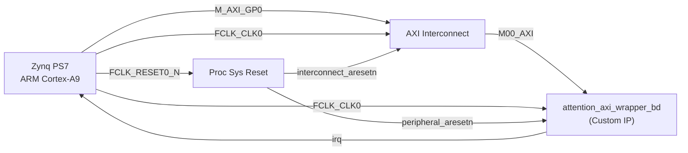

# Vivado Full-Flow Build Script — Walkthrough

## What Was Created

[build_vivado.tcl](file:///Users/spartan/Downloads/AntiGravity/build_vivado.tcl) — a comprehensive Vivado TCL script that automates the complete FPGA build flow for the attention accelerator.

## Why a Block Design Approach?

The existing standalone synthesis had critical issues visible in the reports:

| Issue | Root Cause | Fix |
|-------|-----------|-----|
| **28,868 IOBs used** (100 available) | `attention_top` exposes huge unpacked arrays (Q_mem, K_mem, V_mem, O_mem) as top-level ports | Wrap in AXI-Lite; PS7 accesses registers via bus |
| **No timing constraints** | No clock was defined for the `clk` port | Zynq PS7's `FCLK_CLK0` auto-generates the constraint |
| **250W power / junction exceeded** | Massive I/O toggle power from 28K fake IOBs | Eliminated by removing all direct I/O |
| **"NA" timing** | No constraints → nothing to analyse | PS7 clock + AXI auto-constraints fix this |

## Block Design Architecture



## Build Flow Steps

| Step | Action | Output |
|------|--------|--------|
| 1 | Create project (`xc7z010clg400-1`) | `.xpr` project file |
| 2 | Add all 18 RTL sources | Sources in project |
| 3 | Add testbench | Sim fileset configured |
| 4 | **Build block design** (PS7 + AXI IC + wrapper + reset) | `attention_system.bd` |
| 5 | Add timing constraints | XDC file |
| 6 | **Behavioural simulation** | Runs `tb_attention_top` to `$finish` |
| 7 | **Synthesis** (PerfOptimized_high, retiming ON) | Synth reports |
| 8 | Synthesis reports | `Report/synth_*.rpt` |
| 9 | **Implementation** (Performance_ExplorePostRoutePhysOpt) | Placed & routed design |
| 10 | Implementation reports | `Report/impl_*.rpt` |
| 11 | **Bitstream generation** | `attention_accel.bit` |
| 12 | **Export HW platform** | `attention_accel.xsa` |

## Key Design Decisions

- **Synthesis strategy**: `Flow_PerfOptimized_high` with retiming enabled — maximises Fmax
- **Implementation strategy**: `Performance_ExplorePostRoutePhysOpt` — enables post-route physical optimisation for timing closure
- **Parallelism**: All runs use `-jobs 4` for multi-threaded execution
- **Reports generated**: 12 reports covering utilization, timing, power, clock networks, DRC, methodology, I/O, and route status

## How to Run

```bash
# From the AntiGravity directory:
vivado -mode batch -source build_vivado.tcl

# Or in Vivado GUI Tcl console:
source build_vivado.tcl
```

> [!IMPORTANT]
> The script must be run from the `AntiGravity/` directory so that relative paths (`./rtl`, `./tb`, `./Report`) resolve correctly.

## Reports Generated

### Post-Synthesis (Step 8)
- `synth_utilization.rpt` — LUT, FF, BRAM, DSP usage
- `synth_timing_summary.rpt` — WNS/TNS with real constraints
- `synth_power.rpt` — Estimated power (should be ~1–5W now, not 250W)
- `synth_clock_networks.rpt` — Clock tree analysis
- `synth_methodology.rpt` — Design rule checks
- `synth_drc.rpt` — Design rule violations

### Post-Implementation (Step 10)
- `impl_utilization.rpt` + `impl_utilization_hierarchical.rpt`
- `impl_timing_summary.rpt` — Final WNS/TNS
- `impl_timing_detail.rpt` — Top 50 critical paths
- `impl_power.rpt` — Accurate post-route power
- `impl_clock_utilization.rpt` — BUFG/MMCM usage
- `impl_route_status.rpt` — Routing completion
- `impl_io.rpt` — I/O pin assignments
- `impl_drc.rpt` + `impl_methodology.rpt`
